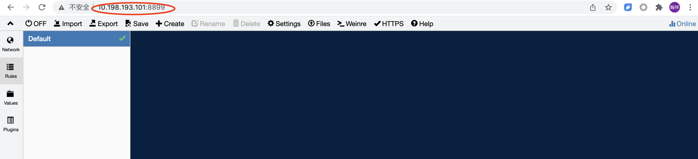
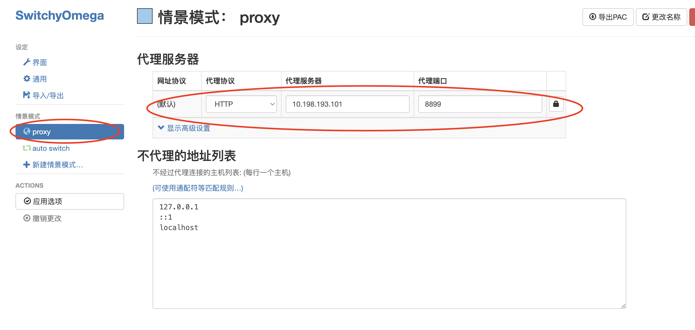
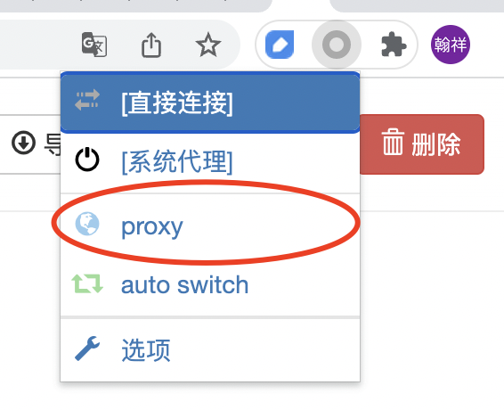
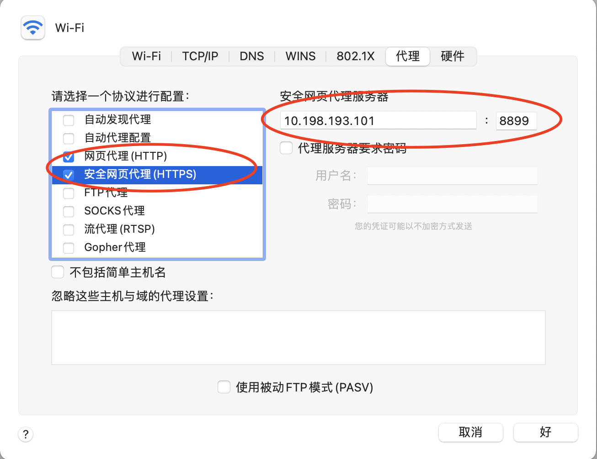
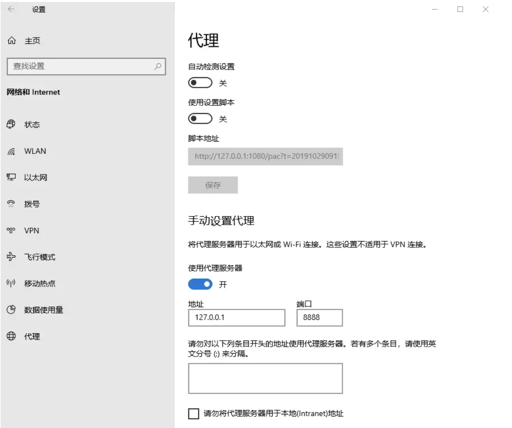
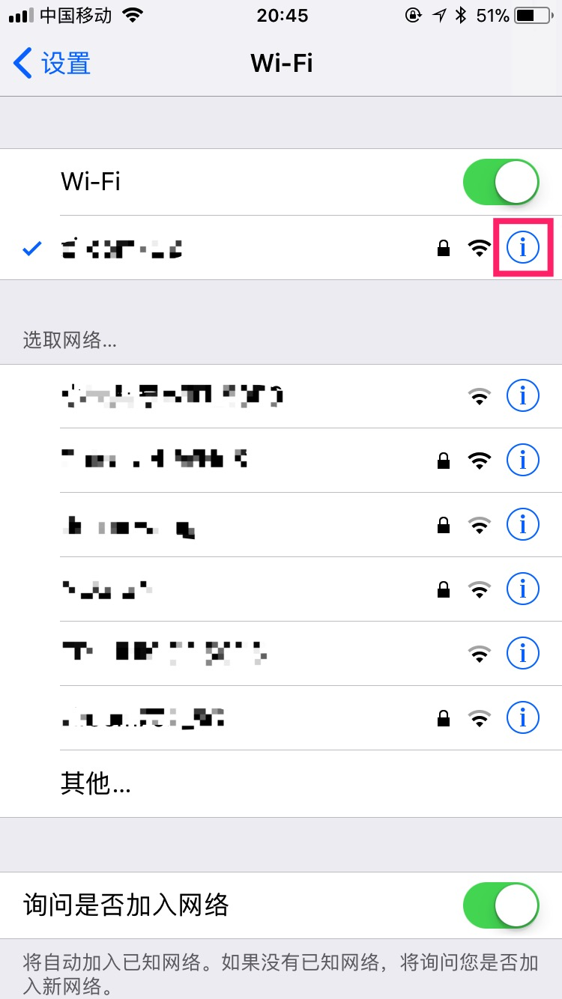
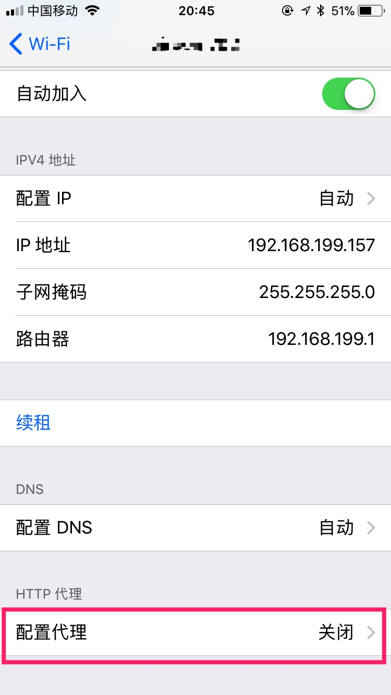
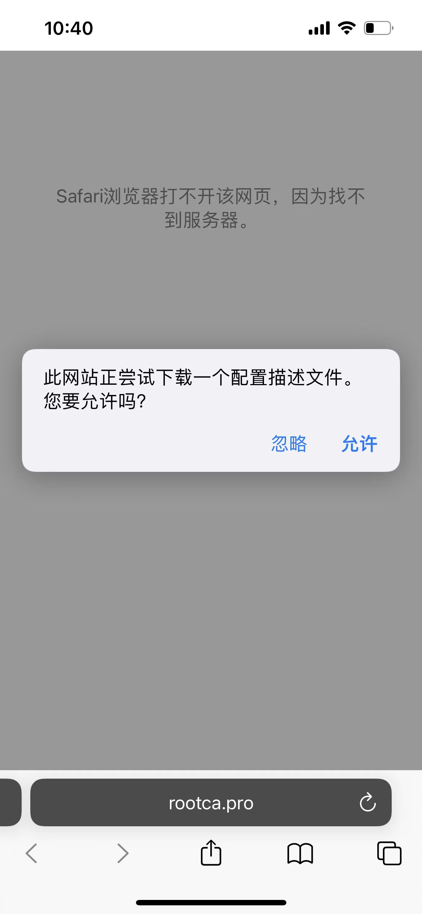
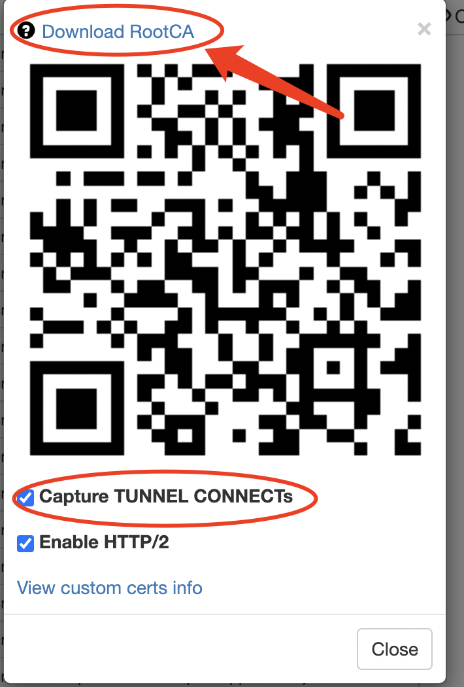
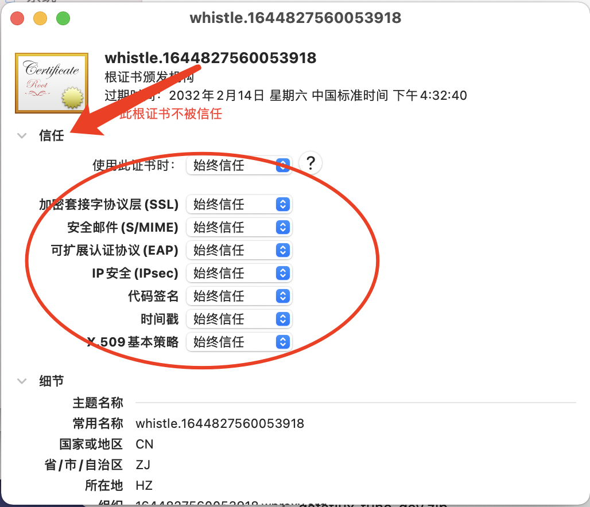

# whistle-docker
whistle-docker

官方文档 http://wproxy.org/whistle/

### 一、docker打包命令

目前的话在mac上打包镜像（m1）芯片，需要注意打包命令


arch命令是Linux的基本命令，输出机器的体系结构

docker build --platform linux/x86_64 -t whistle-docker .

docker build  -t whistle-docker .


### 二、docker部署问题

因为每次重新部署docker的话 https的证书都会改变，影响体验。

http://wproxy.org/whistle/webui/https.html

文档介绍：

自定义请求证书或根证书

whistle会自动生成根证书，并根据根证书对每个请求动态生成https证书，如果需要用自定义的证书，甚至根证书，可以有两种方式(只支持 `.crt` 格式的证书)：

1. 把普通证书对 (如：`test.crt` 和 `test.key`、`test2.crt` 和 `test2.key` 等等) 或根证书 (名字必须为 `root.crt` 和 `root.key`)，放在系统的某个目录，如 `/data/ssl`，并在启动时添加启动参数 `w2 start -z /data/ssl` ，whistle会自动加里面的证书

2. (v1.14.8及以上版本支持) 把上述证书或根证书放在固定目录

    

   ```
   ~/.WhistleAppData/custom_certs/
   ```

   里面，whistle会自动加里面的证书

   > 优先级 `-z dir` > `~/.WhistleAppData/` > 内置证书


我们需要找到本机的证书位置

find . -name "rootCA.crt"

位置：**./downloads/~/.WhistleAppData/custom_certs/**

我们把对应的证书(root.crt 和 root.key) 拷贝出来 放在./rootCA里面即可。


<!-- START doctoc generated TOC please keep comment here to allow auto update -->
<!-- DON'T EDIT THIS SECTION, INSTEAD RE-RUN doctoc TO UPDATE -->

- [Whistle Dev](#whistle-dev)
  - [一、基础配置相关](#%E4%B8%80%E5%9F%BA%E7%A1%80%E9%85%8D%E7%BD%AE%E7%9B%B8%E5%85%B3)
  - [二、web chrome配置](#%E4%BA%8Cweb-chrome%E9%85%8D%E7%BD%AE)
  - [三、 全局配置](#%E4%B8%89-%E5%85%A8%E5%B1%80%E9%85%8D%E7%BD%AE)
  - [四、手机配置](#%E5%9B%9B%E6%89%8B%E6%9C%BA%E9%85%8D%E7%BD%AE)
  - [五、安装https证书](#%E4%BA%94%E5%AE%89%E8%A3%85https%E8%AF%81%E4%B9%A6)

<!-- END doctoc generated TOC please keep comment here to allow auto update -->

# Whistle Dev

[Whistle](https://github.com/avwo/whistle) 是一款 Web Debugging Proxy，类似的工具还有 Fiddler，Charles。不过，Fiddler 在 macOS 上不尽完美（我没有开启成功过，不知道什么情况），Charles 则是收费的。而 Fiddler 作为一款免费的开源软件，也能够满足开发中调试的要求。

更nb的操作可以参考官方文档 https://wproxy.org/whistle/

## 一、基础配置相关

1、线上地址

线上网址： whistle-dev.mfe.svc.nvsdbl.k8.nevis.sina.com.cn:8899

实际地址：http://10.198.193.101:8899/



2、注意事项（坑）

2.1、终端设备不可以开启梯子(VPN)

2.2、终端设备需要连接公司的网络或者VPN

2.3、使用过后记得关闭该代理


## 二、web chrome配置

浏览器代理的话要使用浏览器的代理插件，这里介绍chrome和firefox两种：

1、chrome：使用[SwitchOmega](https://link.juejin.cn?target=https%3A%2F%2Fchrome.google.com%2Fwebstore%2Fdetail%2Fproxy-switchyomega%2Fpadekgcemlokbadohgkifijomclgjgif)插件。

配置相应的http和https的代理





2、firefox：地址栏输入访问 about:preferences，找到 Network Proxy，选择 手动代理配置(Manual proxy configuration)，输入代理服务器地址、端口，保存即可。


## 三、 全局配置

1、Mac 配置

Mac: 系统偏好设置 > 网络 > 高级 > 代理 > 网页代理(HTTP) 和 安全网页代理(HTTPS)



2、windows配置

Windows: 菜单 > 设置 > 网络和Internet > 代理




3、linux配置可以参考官网 

https://wproxy.org/whistle/install.html


## 四、手机配置

1、这里，我们设置自己手机的代理（以 iOS为例），在设置 -> Wi-Fi -> 点击连接的网络右边的 i 图标



点击 HTTP 代理



将 HTTP 代理设为手动，并填入 Whistle 提示中的 IP 与端口

（服务器  10.198.193.101 端口 8899）

现在，手机的流量就会经过电脑代理了

下一步就是实现 HTTPS 的抓包

手机访问 `rootca.pro`，开始下载证书。



设置-通用-VPN与设备管理-找到（whistle相关开通的证书进行安装启用）


之后就可以愉快的进行抓包了。

## 五、安装https证书

1、下载证书

1.1、在配置代理的设备上打开浏览器，在浏览器中输入rootca.pro即可下载，这种是最便捷的方式

1.2、在启动了whistle的机器上用浏览器打开配置页面，点击https，会弹出一个带二维码的界面，点击Download RootCA 或者扫二维码下载



2、安装证书

2.1、下载下来的证书-双击打开-选择信任证书 始终信任证书即可(mac为例子)





3、开启拦截https

   安装好证书之后，必须开启https拦截功能之后，whistle才能看到HTTPS、Websocket的请求。开启https拦截和安装并信任证书，这两个条件缺一不可。 我们需要通过下面的步骤开启https拦截：在启动了whistle的机器上用浏览器打开配置页面，点击https，会弹出一个带二维码的界面，在这个界面勾选Capture HTTPS CONNECTs选项（是不是很熟悉，在下载证书的第2种方法里我们见过的）


